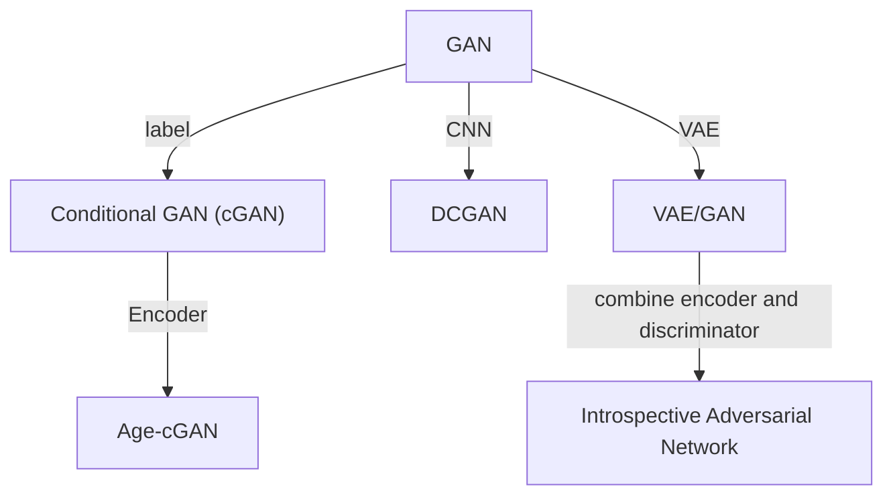

```mermaid
graph TB

```

# Vision

- **Real-time human pose recognition in parts from single depth images**.
Jamie Shotton, Andrew Fitzgibbon, Mat Cook, Toby Sharp, Mark Finocchio, Richard Moore, Alex Kipman, and Andrew Blake.
**CVPR 2011 best paper**.
([pdf](https://www.asc.ohio-state.edu/statistics/dmsl/BodyPartRecognition.pdf)
[project](https://www.microsoft.com/en-us/research/publication/real-time-human-pose-recognition-in-parts-from-a-single-depth-image/)
[TPAMI video](https://www.youtube.com/watch?v=ZXI6gko7kG4)
)
(Citations: **4237**)

pros:

1. Encode temporal consistency with the diff between depth values of neighboring pixels.
2. No temporal information is required.
3. Prevents overfitting with large datasets and bagging.
4. Depth invariance by depth value normalization.
5. Meanshift runs in parallel.
6. Real-time.
7. The body parsing overhead is beneficial to downstream tasks, e.g., tracking init, recovery from failure.
8. Random forest provides some interpretability.
9. Use synthetic datasets to easily increase dataset size.
10. Handles some self-occlusion.
11. Ops (diff between depths) easily coded with GPU.

cons:

1. Doesn't report performance when people are close to background wall (small diff between fore-/back-ground). 
2. The body parsing (segmentation) overhead makes the process slow.
3. Fig 7 shows there's still a huge gap between predicted human parts and g.t.

# Robotics

# Template
- ** **.
.
** **.
([pdf]())
(Citations: )

<div class="boxed" style="background-color:yellow; width:20px">&nbsp</div> 
contribution
<div class="boxed" style="background-color:green; width:20px">&nbsp</div>
method
<div class="boxed" style="background-color:blue; width:20px">&nbsp</div>
result
<div class="boxed" style="background-color:pink; width:20px">&nbsp</div>
settings
<div class="boxed" style="background-color:red; width:20px">&nbsp</div>
question


