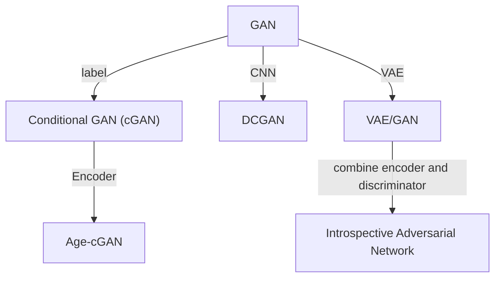

```mermaid
graph TB

```

# Vision

- **Real-time human pose recognition in parts from single depth images**.
Jamie Shotton, Andrew Fitzgibbon, Mat Cook, Toby Sharp, Mark Finocchio, Richard Moore, Alex Kipman, and Andrew Blake.
**CVPR 2011 best paper**.
([pdf](https://www.asc.ohio-state.edu/statistics/dmsl/BodyPartRecognition.pdf)
[project](https://www.microsoft.com/en-us/research/publication/real-time-human-pose-recognition-in-parts-from-a-single-depth-image/)
[TPAMI video](https://www.youtube.com/watch?v=ZXI6gko7kG4)
)
(Citations: **4237**)

pros:

1. Encode temporal consistency with the diff between depth values of neighboring pixels.
2. No temporal information is required.
3. Prevents overfitting with large datasets and bagging.
4. Depth invariance by depth value normalization.
5. Meanshift runs in parallel.
6. Real-time.
7. The body parsing overhead is beneficial to downstream tasks, e.g., tracking init, recovery from failure.
8. Random forest provides some interpretability.
9. Use synthetic datasets to easily increase dataset size.
10. Handles some self-occlusion.
11. Ops (diff between depths) easily coded with GPU.

cons:

1. Doesn't report performance when people are close to background wall (small diff between fore-/back-ground). 
2. The body parsing (segmentation) overhead makes the process slow.
3. Fig 7 shows there's still a huge gap between predicted human parts and g.t.
4. 3D feature is interpretable, can be visualized and satisfies geometric properties (can apply rotation matrix to)

- **Unsupervised Geometry-Aware Representation for 3D Human Pose Estimation**.
Rhodin, Helge, Mathieu Salzmann, and Pascal Fua.
**ECCV2018**.
([pdf](http://openaccess.thecvf.com/content_ECCV_2018/papers/Helge_Rhodin_Unsupervised_Geometry-Aware_Representation_ECCV_2018_paper.pdf))
(Citations:194)

pros:
1. decouple the learning of appearance, geometry, background
2. may be applied to general rigid objects
3. with the same idea of exchanging features, can decouple more, e.g., body shape, expression, hair color, etc, as long as paired images are provided.

cons:
1. comparison is not fair, has been unsupervisedly trained on many images (didn't report)
2. Hard to generalize to image dataset. For single image dataset, finding paired images is difficult.
3. Suitable to fixed camera position, so we can get the background.
4. appearance is not well captured
5. 3D pose estimation is still semi-supervised learning instead of unsupervised learning
6. geometry reconstruction is limited by training data: pitch is not well learned

# Robotics
- **Learning agile robotic locomotion skills by imitating animals**.
Peng, Xue Bin, Erwin Coumans, Tingnan Zhang, Tsang-Wei Lee, Jie Tan, and Sergey Levine.
**RSS2020 best paper**.
([pdf](https://arxiv.org/pdf/2004.00784.pdf)
[project](https://xbpeng.github.io/projects/Robotic_Imitation/index.html)
[code](https://github.com/google-research/motion_imitation)
[video](https://www.youtube.com/watch?v=lKYh6uuCwRY))
(Citations: 122)

techniques:

1. inverse-kinematics: 
   [live coding](https://www.youtube.com/watch?v=hbgDqyy8bIw)
   [talk](https://graphics.cs.wisc.edu/GleicherAssets/Talks/1998_07_retarget-both.pdf)
   [video](https://www.youtube.com/watch?v=Vn-vVzMGgec)
   [paper](https://sci-hub.ru/https://dl.acm.org/doi/pdf/10.1145/280814.280820)
2.  generalized coordinates
3.  root position

pros:

1.  with the author's prior [work](https://xbpeng.github.io/projects/SFV/index.html) 
   "Reinforcement Learning of Physical Skills from Videos", we can leverage videos in-the-wild.
2. Inverse kinemetics is applicable to collecting human motion data to train human-like 2-foot robots.
3. Honestly state the shortcomings, e.g., not able to learn more dynamic behaviors.

cons:

1. How to interact with changing environment? Searching $z$ to adapt to environment works for a certain kind of environment. What if the robot goes from indoor to outdoor?
3. Not able to learn more dynamic behaviors such as large jumps and runs.
4. The behaviors learned by our policies are currently not
    as stable as the best manually-designed controllers.
5. Accessing training data is expensive. Pets may not do the actions that  researchers want (e.g., backflip). Hard to capture any animals, e.g., snakes, birds. Cannot learn from videos in-the-wild.
6. Lack of creativity? Combination of prior work.
7. Inverse kinemetics is only applicable to robots with similar structures. Hard to collect data for robots with fewer or more legs.
8. In reward function, $\exp(-x)$, when $x$ is large, derivative is small. Maybe leads to slow convergence?
9. From Robust to Adaptive (Before), there is not significant improvement? Does mean finetuning based on environment is more important than training with random environment? Is the encoder necessary? 

# Template
- ** **.
.
** **.
([pdf]())
(Citations: )

<div class="boxed" style="background-color:yellow; width:20px">&nbsp</div> 
contribution
<div class="boxed" style="background-color:green; width:20px">&nbsp</div>
method
<div class="boxed" style="background-color:blue; width:20px">&nbsp</div>
result
<div class="boxed" style="background-color:pink; width:20px">&nbsp</div>
settings
<div class="boxed" style="background-color:red; width:20px">&nbsp</div>
question


